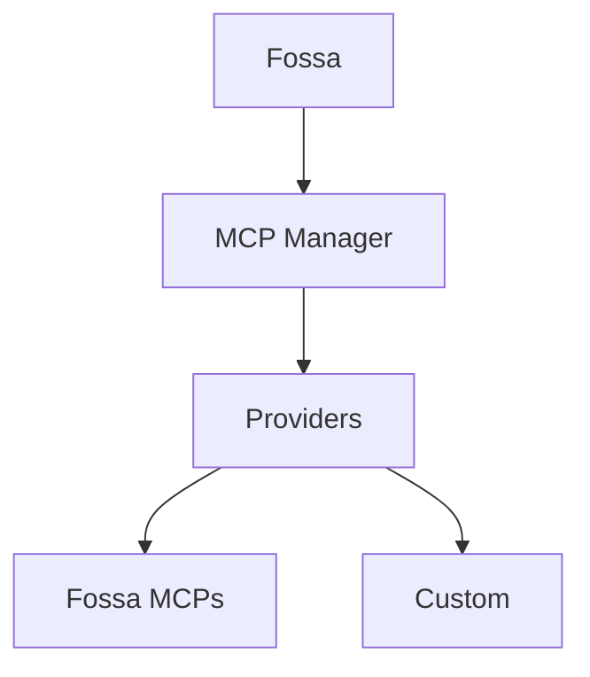

## What are MCPs?

Model Context Protocol (MCP) is an open standard that lets LLM apps connect to
external tools and data sources through a consistent server interface. MCP
servers publish tool schemas and endpoints so clients like Fossa/Fossy can fetch
context or run actions during a workflow.

## MCP Manager Architecture

MCP Manager is the backend service that brokers those MCP connections for
Fossa. It keeps track of providers, integrations, and allowed tools per
workspace, then exposes that catalog to the Fossa API.

- Central registry for MCP providers (Fossa and custom)
- Stores integration metadata (connection status, MCP URL, allowed tools)
- Handles provider-specific authentication flows and tool discovery
- Exposes APIs used by Fossa to list and invoke MCP tools

## Plugins in Fossa

Everything registered in MCP Manager appears in the Fossa **Plugins** screen,
so your team can install, manage, and enable the MCPs available for each
workspace.

## Providers

### Fossa provider

The Fossa provider bundles first-party MCPs managed by Fossa, including the
Fossa MCP, Context7 MCP, and Fossa Docs MCP.

### Custom providers

You can add custom providers to integrate internal systems or third-party
platforms. In self-hosted deployments, list the provider in
`API_MCP_MANAGER_MCP_PROVIDERS`, then implement the provider in the MCP Manager
codebase. The reference implementation lives here:
[fossa-mcp-manager repo](https://github.com/brittytino/fossa-mcp-manager#-adding-a-new-provider)
