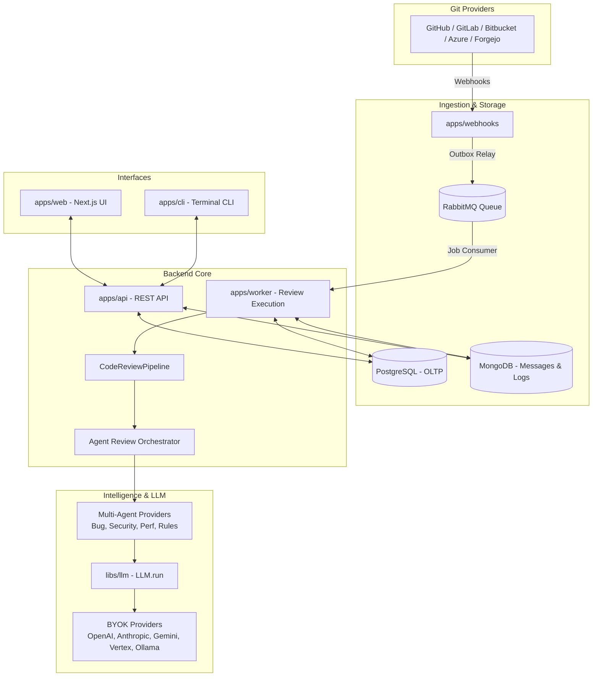
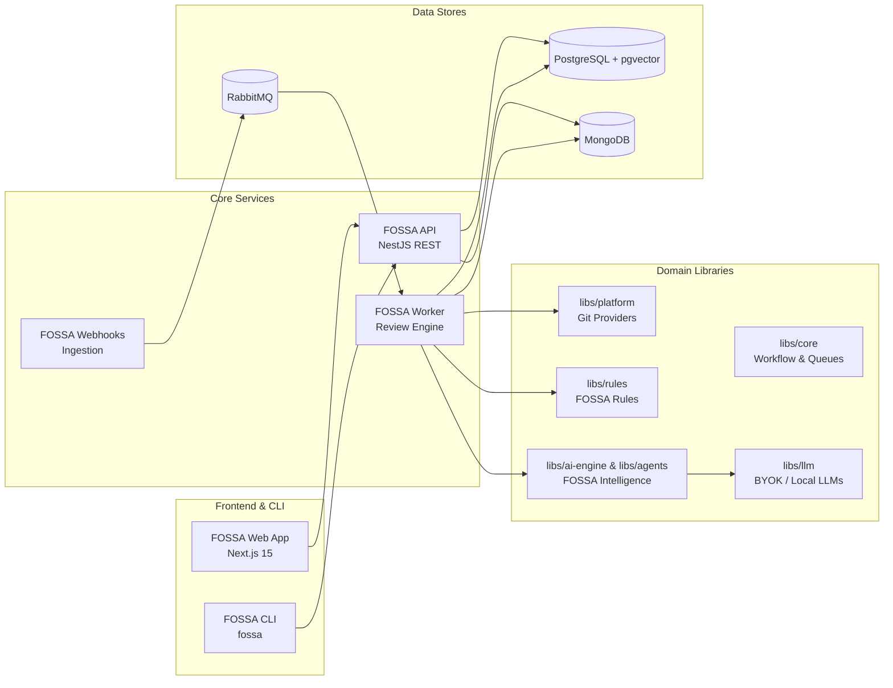

# FOSSA - Repository Transformation & Migration Plan

**Document Version:** 1.0.0  
**Date:** 2026-09-26  
**Status:** Approved for Execution  
**Project:** FOSSA (Free, Open-Source, Self-Hosted AI Engineering & Code Intelligence Platform)

---

## 1. Repository Overview

The repository is a TypeScript monorepo managed with **pnpm workspaces** (pnpm 11.9.0) and Node.js 22. It was originally derived from the Fossa AI codebase.

### Workspace Inventory
- **Applications (`apps/` - 9 apps):**
  - `apps/api`: NestJS REST API (authentication, review orchestration, repository configs, integrations, permissions).
  - `apps/web`: Next.js 15 App Router web dashboard (Radix UI, React Query v5, TailwindCSS 4, diff rendering).
  - `apps/worker`: RabbitMQ consumer handling asynchronous code review execution, agent workflows, and monitoring.
  - `apps/webhooks`: High-throughput webhook ingestion for Git providers with an outbox relay pattern.
  - `apps/cli`: Terminal CLI tool for local and CI/CD code reviews (`@fossa/cli`, MIT-licensed).
  - `apps/analytics-cli`: Specialized CLI for review analytics.
  - `apps/ast-cli`: CLI for AST parsing and dependency graph extraction.
  - `apps/mcp-manager`: Model Context Protocol manager service.
  - `apps/try`: Commercial demo web application (`try.fossa.local`) for cloud evaluation.
- **Libraries (`libs/` - 27 domain modules):**
  - Core domain: `core`, `shared`, `common`, `platform`, `platformData`, `identity`, `organization`, `notifications`, `issues`.
  - Review & AI: `code-review`, `ai-engine`, `agents`, `agent-harness`, `llm`, `fossyRules`, `fossyFineTuning`, `cli-review`, `sandbox`, `mcp-server`.
  - Cloud / Enterprise / Telemetry: `ee` (12 submodules), `feature-gate`, `telemetry`, `analytics`, `cockpit`, `automation`, `centralized-config`.
- **Infrastructure & Storage:**
  - PostgreSQL 16 with `pgvector` (TypeORM migrations & entities).
  - MongoDB 8.2 (Mongoose schemas for review comments, suggestions, summaries, telemetry).
  - RabbitMQ with delayed message exchange plugin for task orchestration.
  - Docker Compose environments for development and self-hosted production.

---

## 2. Current Architecture

### Review Flow Lifecycle
1. Git provider delivers pull request webhook to `apps/webhooks`.
2. `webhooks` stores the event in Postgres and enqueues a review job in RabbitMQ via the outbox pattern.
3. `apps/worker` claims the job with an inbox idempotency lease.
4. Worker invokes `CodeReviewPipeline`, executing sequential stages:
   - `FetchChangedFilesStage`: Pulls changed files and diff patches.
   - `ResolveConfigStage`: Loads configuration and parameters.
   - `ValidatePrerequisitesStage`: Checks review validity (previously entangled with commercial license gates).
   - `CreateSandboxStage`: Allocates an execution sandbox if required.
   - `AgentReviewStage`: Runs specialized AI agents (`BugAgentProvider`, `SecurityAgentProvider`, `PerformanceAgentProvider`, `GeneralistAgentProvider`, `FossyRulesAgentProvider`).
   - `ValidateSuggestionsStage`: Deduplicates and checks AST/syntax validity of suggestions.
   - `AggregateResultsStage`: Consolidates agent findings into a cohesive review plan.
   - `CreateFileCommentsStage` & `CreatePrLevelCommentsStage`: Generates line-level and PR-level comments.
   - `finish-comments`: Publishes review comments back to the Git provider.

---

## 3. License Boundaries

Upstream declared a dual-license structure:
- **AGPL-3.0**: Applies to open-source components.
- **Fossa Enterprise License (`license_ee.md`)**: Applies to any file with `.ee.` in its filename or located in an `ee/` directory.

### Mandatory Legal Boundaries for FOSSA:
1. **Zero Enterprise Code:** Code under `license_ee.md` forbids merging into open-source forks. All files matching `*.ee.*` and directories under `ee/` must be stripped.
2. **Preserve Upstream Notices:** Retain historical copyright attribution (`Fossa Tech and contributors`) in license headers and `NOTICE` files for AGPL-3.0 compliance.
3. **No Commercial Gating:** Remove all code whose sole purpose is commercial monetization, subscription validation, or SaaS metering.

---

## 4. Enterprise Components To Remove

The following proprietary directories and files must be eliminated:

1. **`libs/ee/license/`**:
   - `self-hosted-license.service.ts`: Ed25519 JWT license verification, seat licensing, expiry verification.
   - `license.service.ts`, `license.module.ts`, `tier/`, `guards/`, `interfaces/`.
2. **`libs/ee/analytics-warehouse/`**:
   - Proprietary enterprise data warehouse, schemas, ingestion crons, and migrations.
3. **`libs/ee/sso/`**:
   - Commercial SAML SSO integration and domain verification services.
4. **`libs/ee/linked-repositories/`**:
   - Cross-repository review context explicitly protected by an enterprise `LICENSE` file.
5. **`libs/ee/codeReviewSettingsLog/`**:
   - Enterprise audit logging module for settings changes.
6. **`libs/ee/shared/services/permissionValidation.service.ts`**:
   - Commercial validation service enforcing `PlanType` (Free, BYOK, Managed, Trial), blocking reviews on `INVALID_LICENSE` or `CREDITS_EXHAUSTED`.
7. **`libs/core/providers/*.ee.ts`**:
   - `code-review-pipeline.provider.ee.ts`
   - `file-analyzer.provider.ee.ts`
   - `pipeline.provider.ee.ts`
8. **`libs/ee/codeReview/`**:
   - `stages/fossy-fine-tuning.stage.ts`
   - `fileReviewContextPreparation/`
9. **`apps/web/src/features/subscription/`**:
   - Commercial subscription UI, plan picker, Stripe checkout buttons, seat limits.
10. **`license_ee.md`**:
    - Commercial license agreement file.

---

## 5. Fossa Components To Rename

Migrate terminology consistently across user-facing and configuration surfaces:

| Original Fossa Term | New FOSSA Term | Affected Areas |
| :--- | :--- | :--- |
| **Fossa / Fossa AI** | **FOSSA** | App titles, headers, READMEs, CLI docs, package names |
| **Fossy** | **FOSSA Intelligence / FOSSA** | Review bot author name, PR comments, system prompts |
| **Fossy Rules** | **FOSSA Rules** | Rule configurations, database models, UI tabs |
| **Review Engine** | **FOSSA Review Engine** | Worker logs, pipeline documentation |
| **Context Engine** | **FOSSA Context Engine** | Repository indexer, AST graph, symbol context |
| **CLI (`fossa`)** | **`fossa`** | Binary name, npm package `@fossa/cli`, commands |
| **`.fossa/` & `.fossy/`** | **`.fossa/`** | Workspace config directories |
| **`fossa-config.yml`** | **`fossa.config.yml`** | Repository review configuration file |
| **Docker Containers** | `fossa_api`, `fossa_worker`, etc. | `docker-compose.dev.yml`, `docker-compose.prod.yml` |
| **Docker Network** | `fossa-backend-services` | Docker network definitions |

---

## 6. Fossa Components To Rewrite

Certain components held necessary open-source functionality that was entangled with enterprise checks or placed inside `libs/ee/`:

1. **`CodeBaseConfigService` (was in `libs/ee/codeBase/codeBaseConfig.service.ts`):**
   - **Requirement:** Core review configuration loading from `.fossa/config.yml` and repository parameters.
   - **Action:** Implement a clean open-source `FossaConfigService` in `libs/code-review`, removing all `PermissionValidationService` calls.
2. **Review Rules Service & Repository (was partially in `libs/ee/fossyRules`):**
   - **Requirement:** Custom review rules per repository and organization.
   - **Action:** Provide clean repository and service implementations directly within `libs/fossyRules` (renamed to `libs/rules`), eliminating artificial rule count limits and tier gating.
3. **Task Slot Resolution (`libs/llm` & `validate-prerequisites.stage.ts`):**
   - **Requirement:** Resolving LLM credentials for code review tasks.
   - **Action:** Decouple `PermissionValidationService.resolveTaskSlot` so callers directly query the organization's stored `BYOKConfig` or environment variables without commercial checks.
4. **Feature Gate Service (`libs/feature-gate`):**
   - **Requirement:** Uniform feature availability for self-hosted installations.
   - **Action:** Short-circuit catalog gate evaluations to enable all open-source platform features unconditionally without PostHog cloud fallbacks.

---

## 7. Cloud Components To Remove

Eliminate proprietary SaaS monetization logic:
1. **`apps/try`**: Remove entire public cloud review demo application.
2. **Billing Controllers & Endpoints**:
   - `apps/api/src/controllers/billingEvents.controller.ts`
   - `apps/api/src/controllers/fossaCredits.controller.ts`
   - `apps/api/src/controllers/spendLimit.controller.ts`
   - `apps/api/src/controllers/license.controller.ts`
3. **Billing Analytics Modules**:
   - `libs/analytics/modules/fossa-credits.module.ts`
   - `libs/analytics/modules/spend-limit.module.ts`
4. **SaaS Dependencies**:
   - Remove `stripe` from root `package.json`.
5. **Cloud Deployment & Matrix Testing**:
   - `scripts/e2e/cloud-setup-tenants.sh`, `scripts/preview/materialize-billing-env.sh`.
   - `docker-compose.preview.cloud.yml`.
   - `tests/e2e/playwright/stripe-billing.mjs`, `fossa-credits-checkout.mjs`.

---

## 8. Components To Preserve

Preserve high-value, robust open-source engineering:
- **Reliable Queuing**: RabbitMQ inbox/outbox patterns, distributed locks, retry queues.
- **Git Provider Engine**: GitHub, GitLab, Bitbucket, Azure Repos, Forgejo webhooks and API clients.
- **LLM BYOK Layer**: Provider-neutral client supporting OpenAI, Anthropic, Gemini, Vertex AI, and OpenAI-compatible endpoints (Ollama/vLLM).
- **Multi-Agent Review System**: Specialized review agents for bugs, security vulnerabilities, performance regressions, and architectural rules.
- **AST & Code Graphing**: Tree-sitter AST parsing and symbol graph extraction.
- **Web Dashboard**: Next.js 15 UI for inspecting PR reviews, rule configuration, and review history.
- **CLI Framework**: Command infrastructure supporting local terminal and CI/CD code reviews.

---

## 9. Components To Simplify

1. **Self-Hosted Deployment:** Consolidate dev and prod Docker setups so `docker compose up -d` brings up the complete platform without license keys or external SaaS dependencies.
2. **Telemetry:** Remove mandatory background beacons (`SelfHostedBeaconCron`). Telemetry must be strictly opt-in and off by default.
3. **Configuration Schema:** Strip billing, cloud, and license variables from `.env.schema`, generating a streamlined `.env.example`.

---

## 10. New FOSSA Components

1. **`.fossa/` Configuration Specification:**
   - `.fossa/config.yml`: Main repository review rules, ignore paths, language settings.
   - `.fossa/rules/`: Directory for file-based custom review rules.
   - `.fossa/agents/`: Directory for agent configuration and custom prompts.
2. **`fossa` CLI Suite:**
   - Standardized commands: `fossa init`, `fossa doctor`, `fossa review`, `fossa scan`, `fossa fix`, `fossa config`, `fossa agents`, `fossa rules`, `fossa status`.
3. **FOSSA Visual Brand Identity:**
   - Clean developer-first aesthetic inspired by the fossa species (swift, agile, focused).
   - Unified SVG assets, favicon, and dark-mode color scheme.
4. **Documentation:**
   - Rewritten `README.md`, `CONTRIBUTING.md`, `SECURITY.md`, and self-hosting guides.

---

## 11. Proposed Repository Architecture

---

## 12. Migration Order

Execution must be staged in logical, non-destructive increments:

1. **Step 01 - Audit & Documentation (Completed):**
   - Produce `docs/internal/LICENSE_AUDIT.md` and `docs/internal/FOSSA_MIGRATION_PLAN.md`.
2. **Step 02 - Decouple Core from Enterprise (`libs/ee`):**
   - Provide clean open-source config loader (`FossaConfigService`) in `libs/code-review`.
   - Provide clean OSS rule service and repository.
   - Decouple `validate-prerequisites.stage.ts` from `PermissionValidationService`.
   - Remove `libs/ee` imports across production code and tests.
3. **Step 03 - Remove Enterprise and Cloud Monetization Code:**
   - Delete `libs/ee/`, `license_ee.md`, `libs/core/providers/*.ee.ts`.
   - Delete `apps/try/`.
   - Remove billing controllers (`billingEvents`, `fossaCredits`, `spendLimit`, `license`).
   - Remove `stripe` dependency from `package.json`.
4. **Step 04 - Terminology & Product Identity Rebranding:**
   - Migrate `.fossa/` and `.fossy/` structures to `.fossa/`.
   - Rename default config files to `fossa.config.yml`.
   - Update user-facing text, bot author identities, and prompt strings.
5. **Step 05 - Environment Configuration & Self-Hosting Cleanup:**
   - Clean `.env.schema` and regenerate `.env.example`.
   - Update `docker-compose.dev.yml` and `docker-compose.prod.yml` with FOSSA naming.
   - Disable mandatory beacons in worker crons.
6. **Step 06 - CLI Migration:**
   - Rename `@fossa/cli` -> `@fossa/cli` with executable `fossa`.
   - Remove `subscribe` command; align CLI commands with `fossa init/review/rules/status`.
7. **Step 07 - Frontend UI Rebranding:**
   - Remove `apps/web/src/features/subscription`.
   - Move valid features (`byok`, `token-usage`, `cockpit`, `user-logs`) out of `features/ee`.
   - Replace logos, favicons, metadata, and UI titles with FOSSA branding.
8. **Step 08 - Documentation & Open-Source Attribution:**
   - Rewrite root `README.md`, `CONTRIBUTING.md`, `SECURITY.md`.
   - Update `license.md` (AGPL-3.0) and create `NOTICE` for upstream attribution.
9. **Step 09 - Build, Test, and Validation:**
   - Verify TypeScript compilation, schema validations, and unit tests.
   - Document any known migration gaps in internal notes.

---

## 13. Risks & Mitigations

| Risk | Impact | Mitigation Strategy |
| :--- | :--- | :--- |
| **Broken NestJS Dependency Injection** | High - Application fails to boot | Replace removed EE provider tokens (`LICENSE_SERVICE_TOKEN`, `PERMISSION_VALIDATION_SERVICE_TOKEN`) with lightweight no-op or permissive OSS providers before removing modules. |
| **Next.js Broken Route Handlers** | High - Web frontend compilation fails | Remove subscription routes from Next.js App Router and prune imports in settings layouts before deleting files. |
| **TypeORM Migration Inconsistencies** | Medium - Database startup errors | Remove dropped EE models from `ENTITIES` array in `libs/core/infrastructure/database/typeorm/entities.ts` while preserving all OLTP core schema tables. |
| **Accidental Over-Deletion** | High - Loss of core review logic | Inspect every file before modifying; verify diffs; keep core pipeline stages intact. |

---

## 14. Open Questions

1. **SAML SSO:** Upstream placed SAML SSO in `libs/ee/sso` under the proprietary license. Does FOSSA require SAML SSO in initial release, or is OAuth (GitHub/GitLab) and local JWT sufficient?  
   *Recommendation:* Rely on OAuth (GitHub, GitLab) and JWT for self-hosting initially; implement a clean AGPL SAML adapter in a future release if requested.
2. **MongoDB Long-Term Role:** MongoDB stores review messages and feedback, while PostgreSQL stores users and configuration. Should they eventually be unified into PostgreSQL?  
   *Recommendation:* Retain MongoDB for this initial phase to avoid disrupting working review message schemas; evaluate unifying into PostgreSQL in a future architecture milestone.
3. **E2B Sandbox Dependency:** `libs/sandbox` interfaces with E2B cloud micro-VMs.  
   *Recommendation:* Keep E2B as an optional BYOK integration and ensure local direct execution works as the default fallback.
