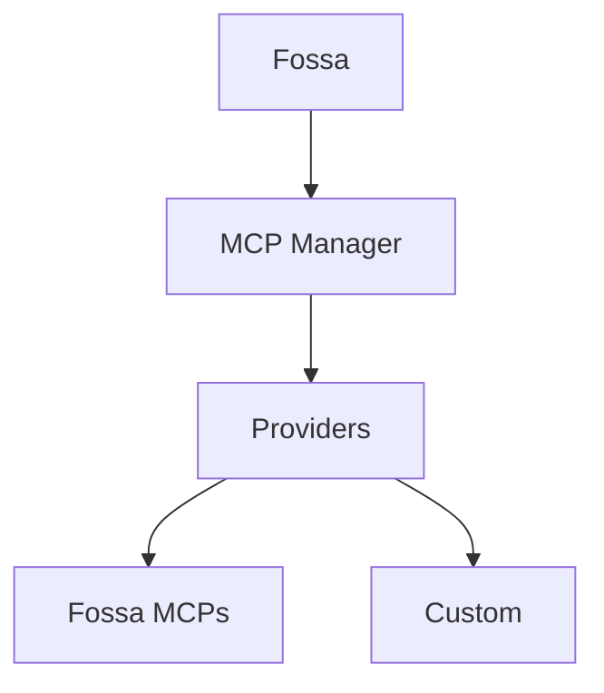

## MCPとは？

Model Context Protocol（MCP）は、LLMアプリが一貫したサーバーインターフェースを通じて外部ツールやデータソースに接続できるオープンスタンダードです。MCPサーバーはツールスキーマとエンドポイントを公開し、Fossa/Fossyのようなクライアントがワークフロー中にコンテキストを取得したりアクションを実行したりできるようにします。

## MCP Managerのアーキテクチャ

MCP ManagerはFossaのMCP接続を仲介するバックエンドサービスです。プロバイダー、インテグレーション、ワークスペースごとに許可されたツールを追跡し、そのカタログをFossa APIに公開します。

- MCPプロバイダー（Fossa、カスタム）の中央レジストリ
- インテグレーションのメタデータ（接続ステータス、MCP URL、許可されたツール）を保存
- プロバイダー固有の認証フローとツール検出を処理
- FossaがMCPツールをリスト・呼び出すために使用するAPIを公開

## FossaのPlugins

MCP Managerに登録されたすべてのものがFossaの**Plugins**スクリーンに表示されるため、チームは各ワークスペースで利用可能なMCPをインストール、管理、有効化できます。

## プロバイダー

### Fossaプロバイダー

FossaプロバイダーはFossaが管理するファーストパーティMCPをバンドルしており、Fossa MCP、Context7 MCP、Fossa Docs MCPが含まれます。

### カスタムプロバイダー

内部システムやサードパーティプラットフォームを統合するためにカスタムプロバイダーを追加できます。セルフホスト型デプロイメントでは、`API_MCP_MANAGER_MCP_PROVIDERS`にプロバイダーをリストし、MCP Managerのコードベースにプロバイダーを実装してください。リファレンス実装はこちらにあります：
[fossa-mcp-managerリポジトリ](https://github.com/brittytino/fossa-mcp-manager#-adding-a-new-provider)
