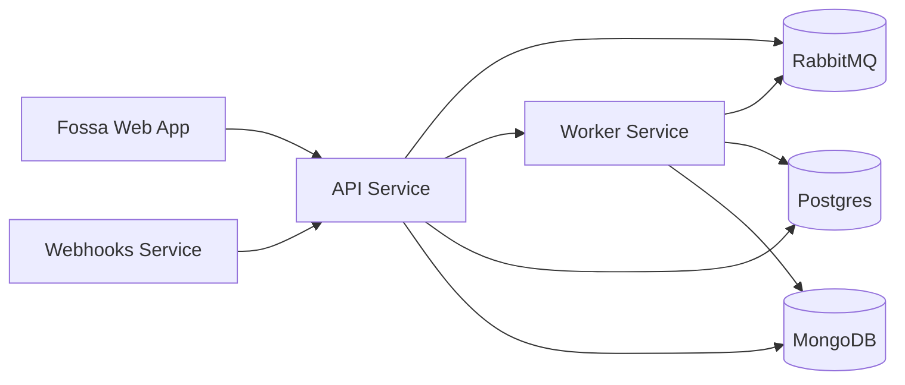

## Visão Geral

Este documento descreve a arquitetura que sustenta a infraestrutura do Fossa. Nosso sistema é construído sobre uma arquitetura distribuída que utiliza contêinerização e segmentação de rede para garantir máxima escalabilidade, segurança e manutenibilidade.

## Redes e Componentes Principais

A infraestrutura é dividida em redes Docker que separam o acesso público
do tráfego interno entre serviços:

- shared-network: Serviços públicos e roteamento de borda
- fossa-backend-services: Comunicação interna entre serviços
- monitoring-network: Tráfego de métricas e observabilidade (opcional)

## Componentes

### 1. Aplicação Web do Fossa

Nossa plataforma frontend é construída com Next.js, oferecendo uma experiência de usuário fluida por meio de comunicação direta com nossa camada de API.

### 2. Serviços de Backend Principais

O stack 2.0 divide as responsabilidades do backend em serviços dedicados:

- API: Camada de serviço central responsável pela lógica de negócios e processamento de requisições
- Worker: Processamento assíncrono para filas e tarefas em segundo plano
- Webhooks: Serviço dedicado para webhooks de provedores Git
- Analytics Worker: Worker opcional de ingestão (`WORKER_ROLE=analytics`) que alimenta os dashboards do Cockpit. Apenas Enterprise — veja [Analytics Worker](/pt-BR/how_to_deploy/deploy_fossa/analytics_worker)

### 3. MCP Manager

O MCP Manager cataloga provedores e integrações, e os disponibiliza para o Fossa para que
as equipes possam instalar MCPs pela tela de Plugins.

### 4. Armazenamentos de Dados

O Fossa utiliza dois bancos de dados:

- Postgres: Dados relacionais e metadados de embeddings
- MongoDB: Armazenamento flexível de documentos

### 5. Mensageria e Observabilidade

O RabbitMQ é obrigatório na versão 2.0, fornecendo comunicação assíncrona confiável
entre a API, o worker e os webhooks.

Prometheus e Grafana são opcionais e utilizados para monitoramento e visualização.

### 6. Serviços Auxiliares (Fossa Cloud)

O Fossa Cloud inclui serviços auxiliares de código fechado (faturamento e
integrações de chat) que não são necessários para implantações self-hosted. Analytics não é exclusivo da cloud: self-hosted Enterprise licenciado roda o mesmo worker de ingestão localmente.

## Próximos Passos
<CardGroup cols={2}>
  <Card title="Executar o Fossa Localmente" icon="laptop" href="/pt-BR/how_to_deploy/local_quickstart/orchestrator">
    Ideal para desenvolvimento local e para se familiarizar com o stack completo do Fossa.
  </Card>
  <Card title="Implantar o Fossa em Produção" icon="rocket" href="/pt-BR/how_to_deploy/deploy_fossa/generic_vm">
    Perfeito para implantação em produção e para aproveitar todas as capacidades do Fossa.
  </Card>
</CardGroup>
